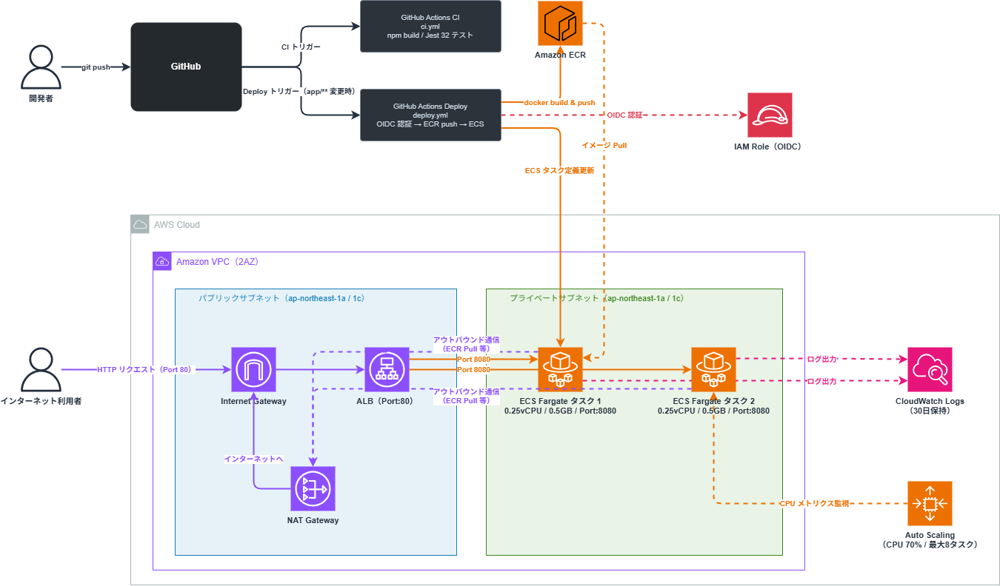

# aws-cicd-ecs-pipeline


GitHub Actions + Amazon ECR + Amazon ECS Fargate による CI/CD パイプラインの実装。
インフラは **AWS CDK（TypeScript）** で管理し、コードプッシュをトリガーに自動でコンテナビルド・デプロイまで実行する。

---

## アーキテクチャ



```
開発者
 │
 │ git push → main
 ▼
GitHub Actions
 ├── [ci.yml]     CDK build & test（TypeScript コンパイル + Jest）
 └── [deploy.yml] Docker build → ECR push → ECS deploy
                       │
                       ▼
              Amazon ECR（コンテナイメージ）
                       │
                       ▼
              Amazon ECS Fargate
              ┌──────────────────────────────────────┐
              │  VPC（2AZ）                           │
              │  ┌─────────────┐ ┌─────────────┐     │
              │  │ Public      │ │ Private      │     │
              │  │  ALB        │ │  Fargate     │     │
              │  │  Port:80    │→│  Port:8080   │     │
              │  └─────────────┘ └─────────────┘     │
              │           NAT Gateway                 │
              └──────────────────────────────────────┘
                       │
              CloudWatch Logs（30日保持）
```

| コンポーネント | 内容 |
|---|---|
| **GitHub Actions (CI)** | `main` push / PR で CDK build & Jest テストを自動実行 |
| **GitHub Actions (Deploy)** | `app/` 変更時に Docker ビルド → ECR push → ECS ローリングデプロイ |
| **Amazon ECR** | コンテナイメージ管理（プッシュ時スキャン・最新10件保持） |
| **ALB** | Internet-facing / HTTP:80 / Multi-AZ（1a・1c） |
| **ECS Fargate** | 0.25 vCPU / 0.5 GB / Port:8080 / プライベートサブネット配置 |
| **Auto Scaling** | CPU 70% 閾値で最大 8 タスクまでスケールアウト |
| **CloudWatch Logs** | ECS タスクログ（30日保持） |
| **AWS CDK** | TypeScript で ECR・VPC・ALB・ECS を IaC 管理 |

---

## CI/CD フロー

### CI（ci.yml）

`main` ブランチへの push / PR で自動実行：

```
git push
 → [cdk-test]   actions/setup-node (Node.js 20)
                → npm ci → npm run build → npm test（Jest 32件）
 → [flask-test] actions/setup-python (Python 3.11)
                → pip install → pytest test_app.py（14件）
```

### Deploy（deploy.yml）

`app/` ディレクトリ変更時のみトリガー（不要なデプロイを抑制）：

```
git push (app/ 変更あり)
 → OIDC で AWS 一時認証（アクセスキー不要）
 → ECR ログイン
 → docker build -t <ECR_URI>:<GIT_SHA> app/
 → docker push
 → ECS タスク定義を最新イメージで更新
 → ECS サービスにデプロイ（サービス安定まで待機）
```

### OIDC 認証の仕組み

AWS アクセスキーを GitHub に保存せず、**OIDC（OpenID Connect）** で一時トークンを発行：

```
GitHub Actions 起動
 → GitHub が OIDC トークンを発行
 → AWS STS が検証・IAM Role を一時 AssumeRole
 → 一時クレデンシャルで ECR / ECS を操作
 → 処理完了後にトークンが自動失効
```

---

## 技術スタック

| カテゴリ | 技術 |
|---|---|
| IaC | AWS CDK v2（TypeScript） |
| CI/CD | GitHub Actions |
| コンテナレジストリ | Amazon ECR |
| コンテナ実行 | Amazon ECS / AWS Fargate |
| ロードバランサー | Application Load Balancer（Multi-AZ） |
| ネットワーク | Amazon VPC（パブリック + プライベートサブネット / 2AZ） |
| オートスケーリング | Application Auto Scaling（CPU ベース） |
| 監視 | Amazon CloudWatch Logs |
| サンプルアプリ | Python 3.11 / Flask |
| デプロイ通知 Lambda | Go 1.22 / aws-lambda-go / aws-sdk-go-v2 |
| テスト | Jest + aws-cdk-lib/assertions / pytest / Go testing |

---

## ディレクトリ構成

```
aws-cicd-ecs-pipeline/
├── .github/
│   └── workflows/
│       ├── ci.yml          # CDK build & test（TypeScript + Jest）+ Flask pytest
│       ├── deploy.yml      # Docker build → ECR push → ECS deploy
│       └── go-test.yml     # Go Lambda ユニットテスト（lambda_go/** 変更時）
├── app/
│   ├── app.py              # Flask サンプルアプリ（/health・/・/info）
│   ├── test_app.py         # Flask ユニットテスト（pytest 14件）
│   ├── requirements.txt
│   └── Dockerfile
├── cdk/
│   ├── bin/
│   │   └── app.ts          # CDK エントリーポイント（スタック組み立て）
│   ├── lib/
│   │   ├── ecr-stack.ts    # ECR リポジトリ（スキャン・ライフサイクル・Output）
│   │   └── ecs-stack.ts    # VPC / ALB / Fargate / Logs / Auto Scaling
│   ├── test/
│   │   ├── ecr-stack.test.ts  # ECR テスト（8件）
│   │   └── ecs-stack.test.ts  # ECS テスト（24件）
│   ├── cdk.json
│   ├── package.json
│   └── tsconfig.json
├── lambda_go/
│   └── deploy-notifier/
│       ├── main.go         # ECS デプロイ完了 SNS 通知 Lambda（Go）
│       ├── main_test.go    # ユニットテスト 4件（SNSPublisher インターフェース モック）
│       └── go.mod          # Go 1.22 / aws-lambda-go / aws-sdk-go-v2
├── docs/
├── .gitignore
├── CHANGELOG.md
└── README.md
```

---

## デプロイ手順

### 前提条件

- AWS CLI 設定済み（`ap-northeast-1`）
- Node.js >= 20
- Docker
- AWS CDK CLI（`npm install -g aws-cdk`）

### 1. CDK 依存パッケージのインストール

```bash
cd cdk
npm ci
```

### 2. CDK Bootstrap（初回のみ）

```bash
cdk bootstrap aws://<ACCOUNT_ID>/ap-northeast-1
```

### 3. インフラのデプロイ

```bash
# ECR スタックを先にデプロイ（ECS がリポジトリを参照するため）
cdk deploy CicdEcsEcrStack

# ECR に初期イメージを push（ECS サービス起動に必要）
ECR_URI=$(aws cloudformation describe-stacks \
  --stack-name CicdEcsEcrStack \
  --query "Stacks[0].Outputs[?OutputKey=='RepositoryUri'].OutputValue" \
  --output text)

docker build -t $ECR_URI:latest app/
aws ecr get-login-password --region ap-northeast-1 | \
  docker login --username AWS --password-stdin $ECR_URI
docker push $ECR_URI:latest

# ECS スタックをデプロイ
cdk deploy CicdEcsAppStack
```

### 4. アクセス確認

```bash
# ALB の DNS 名を確認
aws cloudformation describe-stacks \
  --stack-name CicdEcsAppStack \
  --query "Stacks[0].Outputs[?OutputKey=='LoadBalancerDns'].OutputValue" \
  --output text

# ブラウザで http://<ALB_DNS_NAME> にアクセス
# ヘルスチェック: http://<ALB_DNS_NAME>/health
```

### 5. GitHub Actions のセットアップ

```bash
# Secrets に以下を設定
AWS_ROLE_ARN: arn:aws:iam::<ACCOUNT_ID>:role/<GITHUB_ACTIONS_ROLE>

# deploy.yml の環境変数を自環境に合わせて更新
ECS_CLUSTER: CicdEcsAppStack-Cluster
ECS_SERVICE:  CicdEcsAppStack-FargateService
```

### 6. リソース削除

```bash
cdk destroy CicdEcsAppStack
cdk destroy CicdEcsEcrStack
```

---

## テスト

CDK テストは `aws-cdk-lib/assertions` の `Template` API で CloudFormation テンプレートを検証します。

```bash
cd cdk
npm test
```

| テストファイル | テスト数 | 主な検証内容 |
|---|---|---|
| `ecr-stack.test.ts` | 8 件 | リポジトリ作成・スキャン設定・ライフサイクルルール・削除ポリシー・Output |
| `ecs-stack.test.ts` | 24 件 | VPC / クラスター / タスク定義（ポート・CPU・メモリ・環境変数）/ ALB / Logs / オートスケーリング / Output |
| `test_app.py` | 14 件 | `/health` / `/` / `/info` エンドポイントのステータスコード・レスポンスボディ・環境変数反映・404 |
| `main_test.go` | 4 件 | SNS 通知成功・ failure ステータス・SNS エラー伝播・DeployedAt デフォルト補完 |
| **合計** | **50 件** | |

---

## IAM 設計（最小権限）

### GitHub Actions IAM ロール

| 権限 | 対象リソース | 理由 |
|---|---|---|
| `ecr:GetAuthorizationToken` | `*`（API仕様上不可避） | ECR ログインに必要 |
| `ecr:BatchCheckLayerAvailability` / `ecr:PutImage` 他 | 特定リポジトリ ARN のみ | 他リポジトリへの push を防止 |
| `ecs:DescribeTaskDefinition` / `ecs:RegisterTaskDefinition` | `*` | タスク定義更新に必要 |
| `ecs:DescribeServices` / `ecs:UpdateService` | 特定サービス ARN のみ | 他サービスへの操作を防止 |
| `iam:PassRole` | タスク実行ロール ARN のみ | タスク定義登録時に必要 |

### OIDC Trust Policy

```json
{
  "Condition": {
    "StringEquals": {
      "token.actions.githubusercontent.com:aud": "sts.amazonaws.com",
      "token.actions.githubusercontent.com:sub":
        "repo:satoshif1977/aws-cicd-ecs-pipeline:ref:refs/heads/main"
    }
  }
}
```

- `StringEquals` で完全一致（`StringLike` のワイルドカードは使用しない）
- `main` ブランチのみに絞り込み（PR・feature ブランチからの AssumeRole を防止）

---

## コスト目安（検証時）

| リソース | 概算 |
|---|---|
| ECS Fargate（0.25 vCPU / 0.5 GB × 2タスク） | ~$0.02/時 |
| ALB | ~$0.02/時 |
| NAT Gateway | ~$0.05/時 |
| ECR（ストレージ） | ~$0.10/GB/月 |
| CloudWatch Logs（30日保持・少量） | ほぼ無料枠内 |

> 検証後は `cdk destroy` でリソース削除を推奨。NAT Gateway がコストの主な要因。

---

## 技術的なポイント・工夫

- **CDK TypeScript でスタックを分離**（`EcrStack` / `EcsStack`）し、ECR → ECS の依存関係をコードで表現。スタック間の参照は `ecrStack.repository` をプロパティで受け渡す設計
- **GitHub Actions の OIDC 認証**でアクセスキーを GitHub に保存しない。`id-token: write` パーミッションと IAM ロールの信頼ポリシーを組み合わせた零知識認証フロー
- **`paths: ['app/**']` フィルター**で `cdk/` のみの変更時はデプロイをスキップし、不要なデプロイを抑制
- **`containerInsightsV2`**（CDK v2 最新 API）を使用してコンテナレベルのメトリクスを有効化
- **CDK `assertions` API** でリソースプロパティを型安全にテスト。`Match.arrayWith` / `Match.objectLike` で部分一致検証を実現
- **ECS Fargate をプライベートサブネット**に配置し、ALB 経由のみでアクセス可能にする本番想定構成
- **オートスケーリング**（CPU 70% / 最小 desiredCount・最大 ×4）を CDK で宣言的に定義
- **`RemovalPolicy.RETAIN`** を ECR リポジトリに設定し、スタック削除時もイメージを保持
- **Go Lambda（deploy-notifier）** を `SNSPublisher` インターフェースで設計し、テスト時は AWS 呼び出しなしでモックに差し替え可能。Go の標準 `testing` パッケージのみで 4件のユニットテストを実現

---

## 関連リポジトリ

- [aws-ecs-bedrock-chat](https://github.com/satoshif1977/aws-ecs-bedrock-chat) - ECS Fargate + Bedrock チャットアプリ（Terraform）
- [terraform-3tier-webapp](https://github.com/satoshif1977/terraform-3tier-webapp) - 3層 Web アーキテクチャ Terraform 実装
- [terraform-aws-operations](https://github.com/satoshif1977/terraform-aws-operations) - GuardDuty / Security Hub / CloudWatch 運用監視基盤
- [aws-cdk-3tier-app](https://github.com/satoshif1977/aws-cdk-3tier-app) - CDK TypeScript による 3層アーキテクチャ
